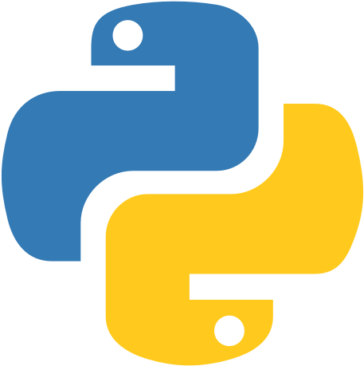

Since Mei 2020, I learn Data a lot from dari <a href="https://dqlab.id/">DQLab</a>. In this platform, my fundamental insights needed to get me well-prepared in data professional career has been build by the complete and updated modules and projects itself from data companies and practitioners. In general, I learn Data from DQLab with three different tools, such as : Python, R, and SQL. Here are the summarize of modules and projects that I have learn (I just posted the medium modules), and also the corresponding certificate.

<h1 align="center">Modules</h1>
<!--  -->

R Programming

   

Fundamental Modules

   

   
   

Application in Industry

   

<!--  -->

Python

   

Fundamental Modules

      
1. [[📚](https://github.com/reynoldms/DQLab-Modules-and-Projects/tree/main/Modules/Python/Fundamentals/1.%20Data%20Wrangling%20Python)] [[🎓](https://academy.dqlab.id/certificate/pdf/DQLABDTWP1TPTMHW)] Data Wrangling Python

2. [[📚](https://github.com/reynoldms/DQLab-Modules-and-Projects/tree/main/Modules/Python/Fundamentals/2.%20Exploratory%20Data%20Analysis%20with%20Python%20for%20Beginner)] [[🎓](https://academy.dqlab.id/certificate/pdf/DQLABINTP1NTUISO)] Exploratory Data Analysis with Python for Beginner
      
3. [[📚](https://github.com/reynoldms/DQLab-Modules-and-Projects/tree/main/Modules/Python/Fundamentals/3.%20Data%20Visualization%20with%20Python%20Matplotlib%20for%20Beginner%20-%20Part%201)] [[🎓](https://academy.dqlab.id/certificate/pdf/DQLABDTWP1KNFUKJ)] Data Visualization with Python Matplotlib for Beginner - Part 1

4. [[📚](https://github.com/reynoldms/DQLab-Modules-and-Projects/tree/main/Modules/Python/Fundamentals/4.%20Data%20Visualization%20with%20Python%20Matplotlib%20for%20Beginner%20-%20Part%202)] [[🎓](https://academy.dqlab.id/certificate/pdf/DQLABINTP1WEHFEA)] Data Visualization with Python Matplotlib for Beginner - Part 2

8. [[📚](https://github.com/reynoldms/DQLab-Modules-and-Projects/tree/main/Modules/Python/Fundamentals/1.%20Data%20Wrangling%20Python)] [[🎓](https://academy.dqlab.id/certificate/pdf/DQLABDTWP1TPTMHW)] Data Quality with Python for Beginner

   

   
   

Application in Industry

 

   

<!--  -->

SQL

   

Fundamental Modules

   

   
   

Application in Industry

   

  

